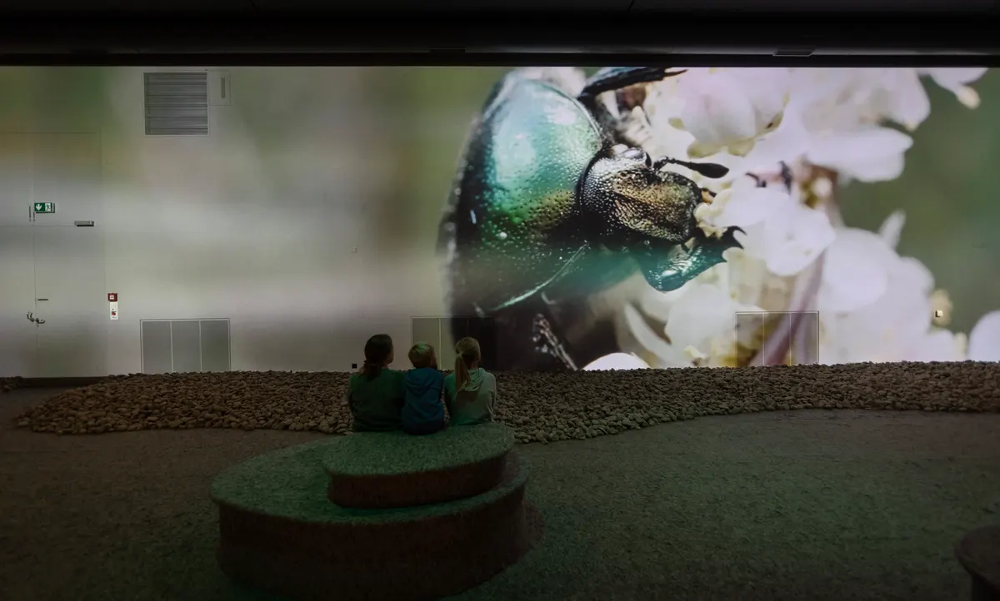

+++
title = "''Alles wird gut, auch bei Insekten''"
date = "2024-02-27"
draft = false
pinned = false
image = "https://www.nmbe.ch/sites/default/files/styles/default_xxxl/public/2023-10/nmbe_insektensterben_key_visual4.jpg?itok=gomJhhoN"
+++
<!--StartFragment-->



Die Situation der Insekten in der Schweiz ist beängstigend. In den letzten drei Jahrzehnten hat der Mensch in verschiedenen Gebieten der Schweiz die Insektenpopulation um 75% reduziert.  Forscher:innen weisen schon lange auf den rapiden Rückgang vieler verschiedener Insektenarten hin. Sowohl dem Aussterben als auch den damit verbundenen Umweltschäden wird keine grosse Aufmerksamkeit geschenkt. Das Naturhistorische Museum Bern greift das brisante Thema auf und entwirft eine Sonderausstellung dazu. "Alles wird gut", so der Titel. Die Ausstellung ist optimistisch. Haben wir auch Grund dazu?



**Robert, Steven und Moritz**

Caruso, steht nicht schlecht auf dem Dach und das jetzt schon seit Herbst 2014. Der goldene Elefant auf dem hohen Dach des Museums wurde zu einer Art Markenzeichen. Er fällt auch immer noch auf, wenn man zum hundertsten Mal das Museum betritt. An der Fassade hängt ein riesiges graues Plakat, das eine von toten Insekten verschmierte Windschutzscheibe zeigt. “Insektensterben - Alles wird gut.” ist mit fetten gelben Buchstaben darauf geschrieben. 

Im obersten Stockwerk des Museums sitzt Simon Jäggi auf dem schwarzen Ledersofa des Pausenraums. Er trägt ein schwarzes Stoffhemd, seine Haare sind zu einem Vokuhila geschnitten, seine gestreiften Socken trägt er über den blauen Cargo Jeans. Er wirkt jung aber trotzdem sehr ernst, vielleicht ist es die Art, wie er dort sitzt und eine Mail verfasst oder ist es doch der scharfe Blick, der Respekt auslöst. Der Raum ist gross und nimmt einen aus der Museums-Atmosphäre heraus, es gibt eine kleine Küche, einen grossen Esstisch und dieses schwarze Ledersofa. 

##### **Kleine Tierchen, grosse Wirkung**

Es ist erschütternd und es macht traurig, wenn man sich mit den Zahlen, Fakten und Statistiken rund um das Aussterben der Insekten um uns herum beschäftigt. Manche macht es vielleicht wütend, dass wir so weitermachen wie immer und wahrscheinlich warten, bis es zu spät ist, bis wir wirklich alle fossilen Rohstoffe aufgebraucht haben und damit Luft, Bäume, Böden, unsere Lebensgrundlage und vor allem die Tierwelt zerstört haben. Doch vielen geht es wahrscheinlich wie dem Grossteil der Menschheit, die es bisher noch kaum beachtet hat. Gehandelt wird erst, wenn der gesellschaftliche Druck hoch genug ist: wenn auch der Nachbar nebenan mit dem Velo in die Stadt fährt und nicht mehr mit dem SUV, die Züge billiger werden als die Flüge. Wenn es Pfandflaschen auch in der Schweiz gibt, dann handeln wir vielleicht. Und aus diesem Grundgedanken entstand die Ausstellung mit dem provokanten Titel. 

> “Es ist der Versuch, eine nicht deprimierende Ausstellung zu einem sehr deprimierenden Thema zu machen.” wo andere vielleicht ihre Waffen niederlegen, fängt Simon Jäggi erst an. 

##### **Journalist, Kurator oder Kummerbube**

Simon Jäggi stellte die Ausstellung mit seinem Team auf die Beine. Es ist seine zweite Ausstellung. Zuvor hatte er “Queer - Vielfalt ist unsere Natur” kuratiert, sie war eine der erfolgreichsten Sonderausstellungen des Naturhistorischen Museums. Im Jahr 2023 erzielte das Naturhistorische Museum (NMBE) das zweitbeste Ergebnis hinsichtlich der  Besucherzahlen. Dies hat es den drei Sonderausstellungen zu verdanken. Bis März die Queer Ausstellung, dann im Sommer mit einer Gemälde- und Grafikausstellung des berner Mundartsängers Büne Huber und als Abrundung des Jahres, startete im November die Insektenausstellung “Alles wird gut”. Doch Simon Jäggi war nicht immer Kurator, früher schrieb er Texte für den Bund und 2004 gründete er mit sechs Freunden die Mundart-Band ,,Kummerbuben”.



##### **Simon Jäggi - Wie der Stein ins Rollen kam**

Gestartet hat er seine Karriere 2007 als Redaktor bei der Zeitung "Der Bund". 2013 wechselte er aus der Branche des Journalismus und wurde Leiter der Kommunikation & Marketing des NMBE. Zwei Jahre später fand er dann in den gleichen vier Wänden seine wahre Berufung und kombinierte sein Können: Das aktive, kunstvolle, bei dem er Fantasie braucht, aber eben auch die Recherchefähigkeiten von früher, er wurde Ausstellungskurator des NMBE. 

Mit einem zweiten Bein stand er auf der Bühne. 2004 gründete er mit sechs Freunden die Mundartband ,,Kummerbuben". 2007 brachten sie ihr erstes Album ,,Liebi und anderi Verbräche” heraus, in dem sie vor allem Schweizer Volkslieder interpretierten. Nach vielen wilden Festival-Auftritten erschien dann 2009 ihr zweites Album "Schattenhang", mit dem sie in die Schweizer Hitparade kamen. Doch 20 Jahre nach der ersten Bandprobe lösen sie sich auf. Nach sechs Alben und 350 Konzerten in der Schweiz und in Deutschland und einem Letzten am 14. Februar in der Mühle Hunziken schliesst sich das Musik-Kapitel ,,Kummerbuben".



##### **Mitten in der Welt der kleinen Tierchen**

Durch die Digitalisierung hat sich die Art und Weise der Ausstellungsgestaltung verändert. Die Museen setzen viel daran, noch immer Präparate und Objekte auszustellen. Doch dafür müssen wir in die Zukunft reisen, genauer gesagt ins Jahr 2052. Wir laufen durch einen Korridor, an dem die Wände voll mit Plakaten, Zeitungen und Stickern, mit fett gedruckten Titeln und roten Aufschriften hängen. Erinnert an ein Jugendzentrum, es könnte genauso gut aus der Reitschule stammen und hinterlässt einen anarchischen Eindruck. Zuhinterst, in einem schwarzen Raum, steht eine grosse SOS-Säule, so wie jene, die sich am Rande einer Autobahn befinden. Nimmt man den Hörer ab, dann berichtet uns ein kleines Mädchen. Es erzählt uns eine Geschichte, die ihr oft von ihren Eltern erzählt würde. Eine Geschichte aus dem Jahr 2023, als die Menschheit gerade anfing auf das Problem des Insektensterbens aufmerksam zu werden. Sie verrät dem Zuhörer auch einen Code, mit dessen Hilfe man durch eine schwere Tür in das Jahr 2052 gelangen kann. Dadurch wird ermöglicht, zu sehen, ob es wirklich so schlimm wird, wie es scheint. Wir gelangen in einen sehr grossen Raum, an dessen Wand können die kleinen Insekten in gross betrachtet werden. Sie stolzieren über Blätter, krabbeln unter Büschen umher und laden uns ein an ihrem Leben teilzuhaben. Der Boden ist aus einer Art Filzstoff und die Wände aus Holz, Borke und einem Gips-Gemisch. Es geht ein kühler Wind. Nach Hoffnung sucht man hier vergeblich. Der Raum wird noch einmal in fünf kleinere unterteilt. Jeder dieser Fünf hat ein eigenes Thema, sei es ein Labor mit Forschungsberichten oder ein Lokal mit Audioinputs. All diese Räume sind sehr schön gestaltet und die Themen interessant in Szene gesetzt. Es ist eine Ausstellung für Jung und Alt für die ganz Kleinen gibt es lustige Suchspiele oder die “Insekten-Zeichnungsstation”, für die Älteren gibt es Tipps und Anregungen, wie sie selbst dem Insektensterben entgegenwirken können. 

Was genau in den Räumen vor sich geht, sollte man am besten selbst erfahren und wir waren jetzt schon zu lange in der Zukunft, es wird Zeit in die Gegenwart zurückzukehren. Am Ende des grossen Raumes ist eine Treppe, über die wir mit jeder Stufe dem heutigen Datum näherkommen. Im obigen Teil der Ausstellung sind noch einige Insektenpräparate und Figuren ausgestellt. Hier finden auch Workshops für Schulklassen und andere Gruppen statt.

##### **Graue Zeiten grüne Zukunft** 

Die Ausstellung gibt Hoffnung zu einem Thema, das eigentlich ziemlich grau ist. Das Bild der grauen Windschutzscheibe stammt noch aus einer Zeit, in der niemand an ein Insektensterben dachte. Man liest immer wieder, dass es zwischen 40’000 und 60’000 Insektenarten in der Schweiz für ein funktionierendes Ökosystem braucht. Doch mehr als 60% von ihnen sind gefährdet. Daran sollten wir dringend etwas ändern, denn so darf es nicht weitergehen. Dazu fordert uns die Ausstellung auf!

##### **Das Museum muss sich verändern**

Das blosse Konsumieren von Fakten und Zahlen ist meist äusserst langweilig und das Meiste vergisst man relativ schnell wieder. Daher sind Museen sehr wichtig, denn sie veranschaulichen diese Fakten und Zahlen kreativ mit Hilfe von Präparaten und Objekten.  Dadurch bleiben die Informationen länger im Gehirn präsent. Heute setzen viele Museen, so auch das NMBE, auf interaktive Ausstellungen, in denen die Besucher*innen nicht nur vor einem Glaskasten mit Scherben oder Tierpräparaten stehen, sondern auf spielerische Art an die Informationen gelangen. Museen sind also dazu da, Informationen so spannend wie möglich zu übermitteln. Auch sie müssen sich im Laufe der Zeit verändern, aber sie werden bleiben. Die Veränderungen sind wichtig, denn es gibt Themen wie den Kolonialismus, die ein modernes Museum aufarbeiten muss. 

Museen sind ein Ort der Wissensvermittlung und -erfahrung. Im Museum können Interessen sei es für Dinosaurier, Fossilien, Pflanzen oder historische Gegenstände erlebbar werden, indem wir mit unseren Sinnen wahrnehmen, Informationen auf interessante und unterhaltsame Weise präsentiert bekommen. Das wir uns  die Zeit nehmen und uns für etwas begeistern, was wir schon immer kennenlernen wollten. Das wird für immer so bleiben, hoffentlich. 

> “Museen sind für die Ewigkeit” - Simon Jäggi

Die Sonderausstellung passt gut ins NMBE, an den Ort, an dem Jung und Alt zusammenkommen und sich der gemeinsamen Faszination für die Flora und Fauna unseres Planeten widmen.

Wir haben allen Grund dazu, optimistisch zu sein, doch wir müssen jetzt zur Tat schreiten. Gemeinsam können wir das Insektensterben und die damit verbundene Kettenreaktion aufhalten. Darauf will uns das Naturhistorische Museum aufmerksam machen. Also “Alles wird gut”!

<!--EndFragment-->